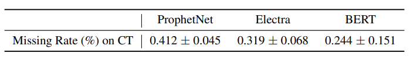

# 执行流程
## 环境
/home/sdb/xx/path/anaconda_path/peft

## 数据集构造
首先去 Prompting文件下执行脚本， 构造Dataset文件夹下的数据。 Prompting 文件夹下文件说明：
- dart.py, e2e_clean.py, webnlg2017.py, webnlg2020.py 为ControlPrefix论文中使用的数据集，可以在其github仓库中找到对应的数据集https://github.com/jordiclive/ControlPrefixes/blob/main/src/data.zip
- mvp_data2text_preprocessing.py 为 MVP论文中使用到的数据集，可以在huggingface仓库中下载 data-to-text数据集 \
 执行完成上述脚本后，可以在Dataset文件夹下，得到对应的增加prompt之后的数据集，目前ControlPrefix数据集对应的prompt为：
```
source_prompt = "Generate a text for the given data: {}.  What is the generated text?"
target_prompt = "The generated text is : {}"
```
mvp 数据集的prompt为：
```
source_prompt = "Describe the following data: "
```
目前做对比实验采用mvp中的数据集。

### Finetune
在Benchmark执行finetune脚本。
- HuggingFace_Data2Text 采用 T5-large
- HuggingFace_Data2Text_MVP 采用 RUCAIBox/mvp-data-to-text


# 以下为原repo Readme
# PromptCast: A New Forecasting Paradigm

## Introduction
This repository is the reporisity of **PromptCast: A New Prompt-based Learning Paradigm for Time Series Forecasting** (currently under submission). PISA is a large-scale dataset including three real-world forecasting scenarios (three sub-sets) with 311,932 data instances in total. It is designed to support and facilitate the novel PromptCast task proposed in the paper. 


## Numerical Time Series Forecasting vs. PromptCast


> Exisiting numerical-based forecasting VS. Prompt-based forecasting

### ***PromptCast Evaluation Metrics***
- RMSE
- MAE
- Missing Rate: whether the numerical forecasting target can be decoded (via string parsing) from the generated output prompts.


## PISA Dataset
### ***Forecasting Scenarios***
The proposed PISA dataset contrains three real-world forecasting scenarios:
- CT: city temperature forecasting
- ECL: electricity consumption forecasting
- SG: humana mobility visitor flow forecasting


> Details of three sub-sets
> 
<br></br>

### ***Folder Structure (see [Dataset](Dataset/README.md))***
```text
Dataset
|── PISA-Prompt
    │── CT
        │-- train_x_prompt.txt
        │-- train_y_prompt.txt
        │-- val_x_prompt.txt
        │-- val_y_prompt.txt
        │-- test_x_prompt.txt
        │-- test_y_prompt.txt
    │── ECL
        │-- train_x_prompt.txt
        │-- train_y_prompt.txt
        │-- val_x_prompt.txt
        │-- val_y_prompt.txt
        │-- test_x_prompt.txt
        │-- test_y_prompt.txt  
    │── SG
        │-- train_x_prompt.txt
        │-- train_y_prompt.txt
        │-- val_x_prompt.txt
        │-- val_y_prompt.txt
        │-- test_x_prompt.txt
        │-- test_y_prompt.txt   
```

## Benchmark Results
Please check [Benchmark](Benchmark/README.md) folder for the implementations of benchmarked methods.
<br></br>


> RMSE and MAE performance
> 
<br></br>



> Missing Rate results
> 
<br></br>


> Results under train-from-scratch and cross-scenario zero-shot settings
> 
<br></br>

If you think this repo is useful, please cite our papers


```
@ARTICLE{xue2023promptcast,
  author={Xue, Hao and Salim, Flora D.},
  journal={IEEE Transactions on Knowledge and Data Engineering}, 
  title={PromptCast: A New Prompt-Based Learning Paradigm for Time Series Forecasting}, 
  year={2023},
  volume={},
  number={},
  pages={1-14},
  doi={10.1109/TKDE.2023.3342137}}

@inproceedings{xue2022translating, 
  title={Translating human mobility forecasting through natural language generation}, 
  author={Xue, Hao and Salim, Flora D and Ren, Yongli and Clarke, Charles LA}, 
  booktitle={Proceedings of the Fifteenth ACM International Conference on Web Search and Data Mining}, 
  pages={1224--1233}, 
  year={2022} 
} 

@inproceedings{xue2022leveraging, 
  title={Leveraging language foundation models for human mobility forecasting}, 
  author={Xue, Hao and Voutharoja, Bhanu Prakash and Salim, Flora D}, 
  booktitle={Proceedings of the 30th International Conference on Advances in Geographic Information Systems}, 
  pages={1--9}, 
  year={2022} 
} 
```
